<div align="center">

# Zyvor Vytrix

[](https://github.com/zyvorai/zyvor-vytrix/actions/workflows/ci.yml)
[](LICENSE)
[](package.json)
[](agent/vytrix.py)
[](docs/TESTING.md)

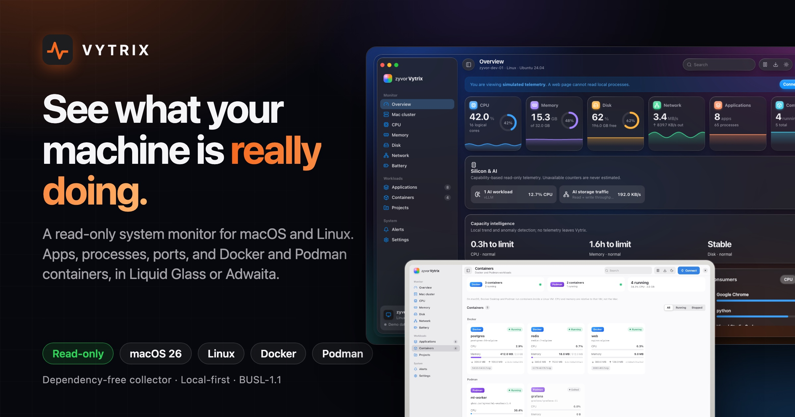

### See what your machine is really doing.

**A read-only system activity monitor for macOS and Linux.** Applications grouped the way you think about them, processes, listening ports, project folders, and Docker and Podman containers, in a macOS 27 window, a macOS 26 Liquid Glass one, or an Adwaita one. A single-file Python collector with no dependencies feeds it.

**Read-only** · **Dependency-free collector** · **macOS 27 + Liquid Glass + Adwaita** · **Docker and Podman aware** · **Local-first**

🎮 **[Live demo](https://zyvorai.github.io/zyvor-vytrix/demo/)** · 🌐 **[Site](https://zyvorai.github.io/zyvor-vytrix/)** · 🚀 **[Quickstart](#quickstart)** · 🧩 **[How it fits](#how-it-fits-together)** · 🔒 **[Security](SECURITY.md)** · 📖 **[API](docs/API.md)**

</div>

## Why Vytrix

| When this happens | Vytrix gives you |
| --- | --- |
| Activity Monitor lists 24 "Google Chrome Helper" rows and you want one number | Processes **grouped by executable or `.app` bundle**, with CPU and memory per application and a process sheet one click away |
| "Which container is eating the box, and is it Docker or Podman?" | State, CPU, memory against its limit, network I/O and published ports for both runtimes, from read-only CLI calls |
| "What is listening on 5173?" | Listening ports tied to the application and its **project folder** |
| You want a monitor on a remote server without an agent suite | One Python file, one systemd unit, HTTPS and a bearer token |
| You will leave it running on a production host | It is **read-only**: it never kills, signals or changes anything |

## See it

**[Try the live demo](https://zyvorai.github.io/zyvor-vytrix/demo/)**: the real dashboard, running in your browser on simulated telemetry (nothing to install, nothing leaves the page).

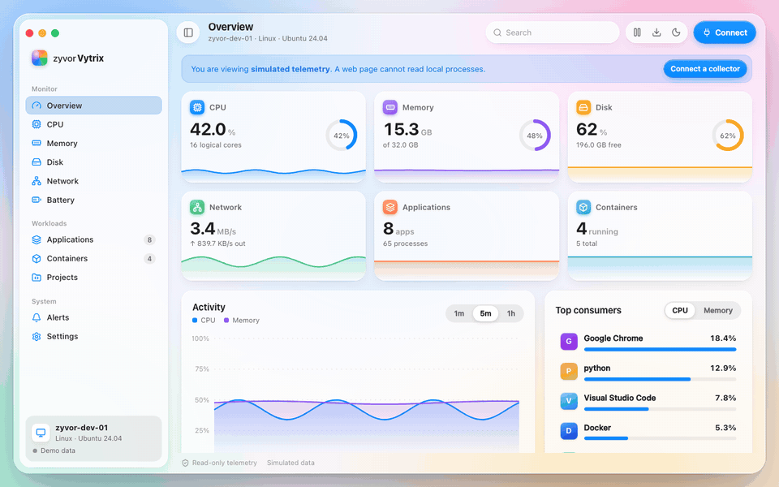

*About 12 seconds against the built-in simulated telemetry: overview, an application's processes, containers, switching to the Adwaita window style, then dark mode.*

| macOS 27, light | macOS 27, dark |
| --- | --- |
| 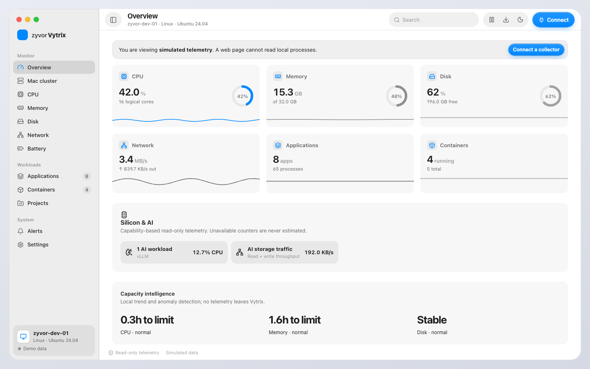 | 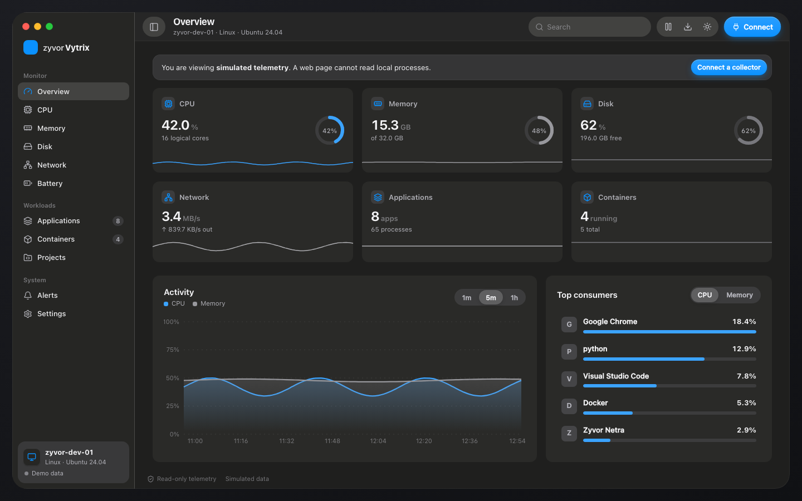 |

| Liquid Glass, light | Liquid Glass, dark |
| --- | --- |
| 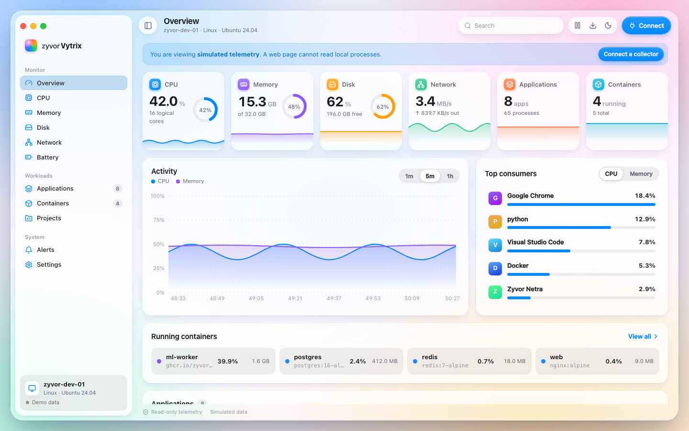 | 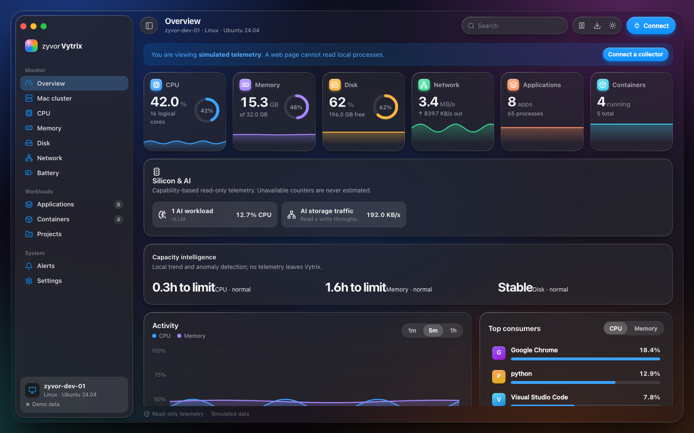 |

| Adwaita, light | Adwaita, dark |
| --- | --- |
| 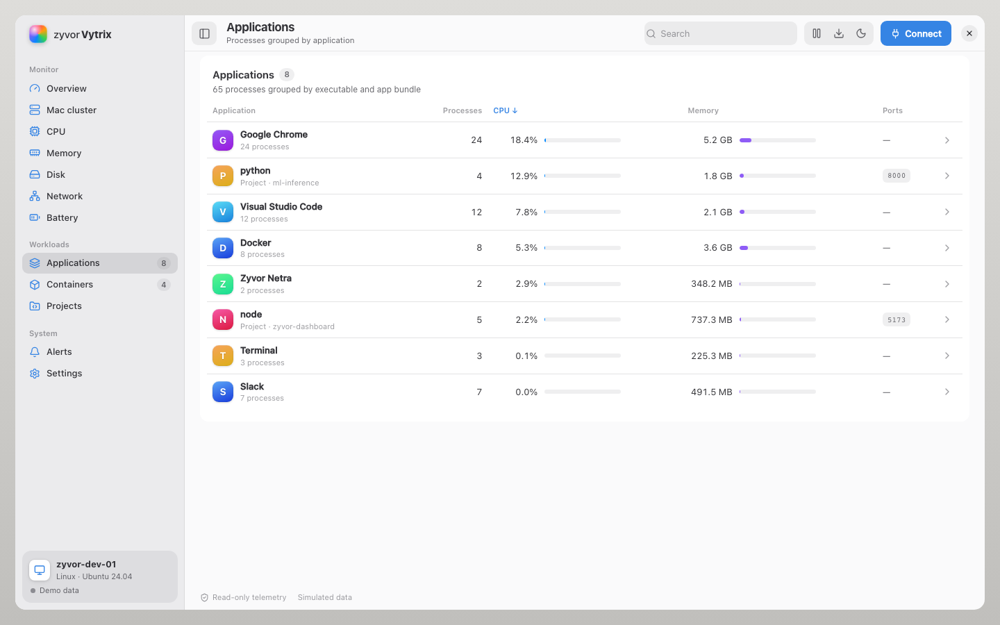 | 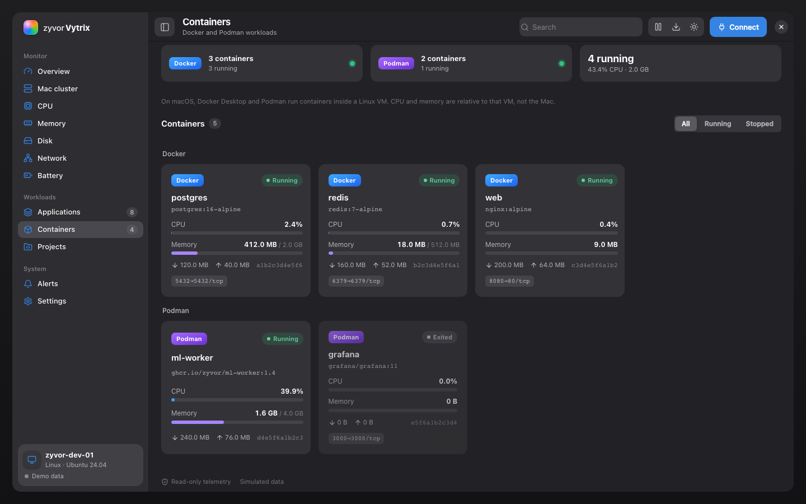 |

| Phone (390px) | Phone, containers |
| --- | --- |
| 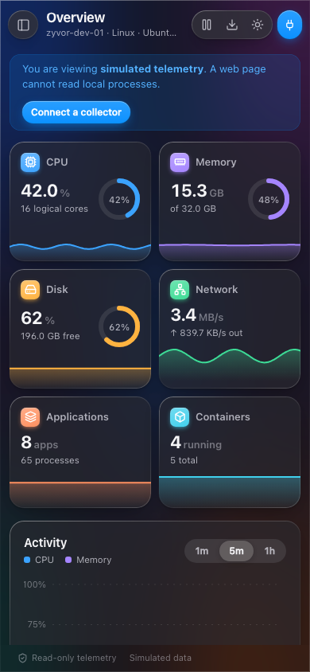 | 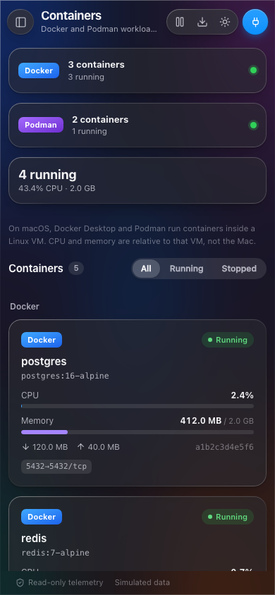 |

*Every image here is the app's built-in **simulated telemetry** (host `zyvor-dev-01`). A web page cannot read your processes, so the hosted preview says so on screen. See the [UX contract](docs/design/UX-CONTRACT.md).*

## How it fits together

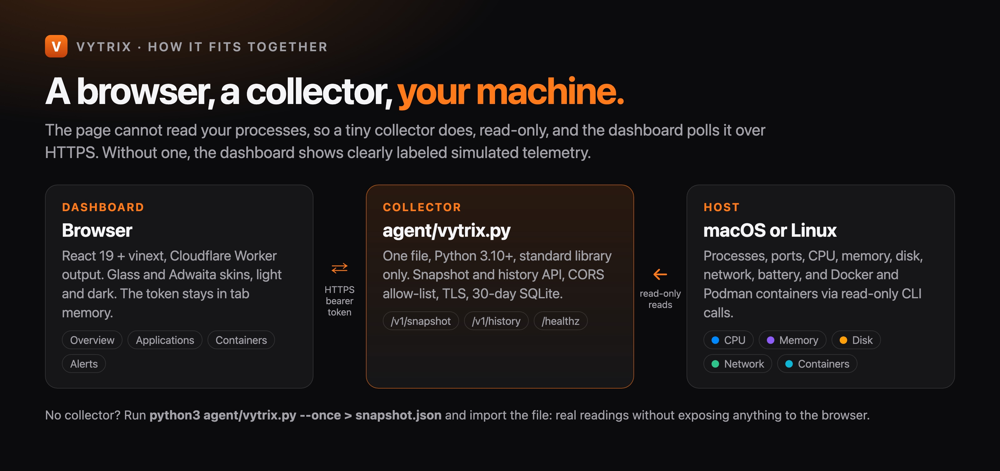

The dashboard starts on **clearly labeled simulated telemetry**. To see your own machine, run the collector and connect (live), or import a one-off snapshot (offline).

## Mac cluster

Optional and read-only: a small worker on each Mac pushes its snapshot to a coordinator, and **Monitor → Mac cluster** shows every machine's CPU, memory, disk, network, applications and containers. There is no command channel. See [docs/CLUSTER.md](docs/CLUSTER.md).

## Native Mac app

A SwiftUI app (`native/`) that shows the same telemetry in a native macOS 27 window. It starts the bundled collector on loopback with a random token held in memory, or connects to one you run elsewhere (Connect…, HTTPS unless it is localhost). It is read-only, like everything else here.

```bash
./scripts/build-native.sh      # native/build/Vytrix.app, ad-hoc signed development build
open native/build/Vytrix.app   # or add --args --demo for simulated telemetry
./scripts/shots-native.sh      # docs/ux/native-*.png, from the simulated telemetry
```

Needs macOS 26 or newer, the Xcode command line tools, and Python 3.10+ for the collector (the system `/usr/bin/python3` is 3.9; the app looks for Homebrew's first). Overview, Applications, Containers and Projects are in; Alerts, per-resource pages and Settings are not yet. Built and run on macOS 27.2.

| Overview, light | Applications, light |
| --- | --- |
| 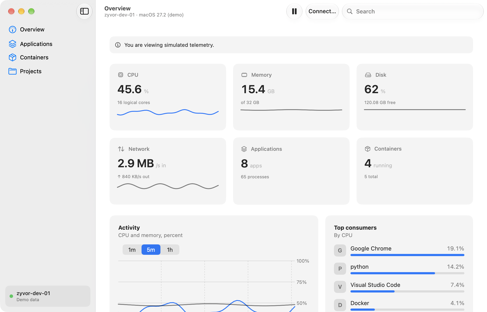 | 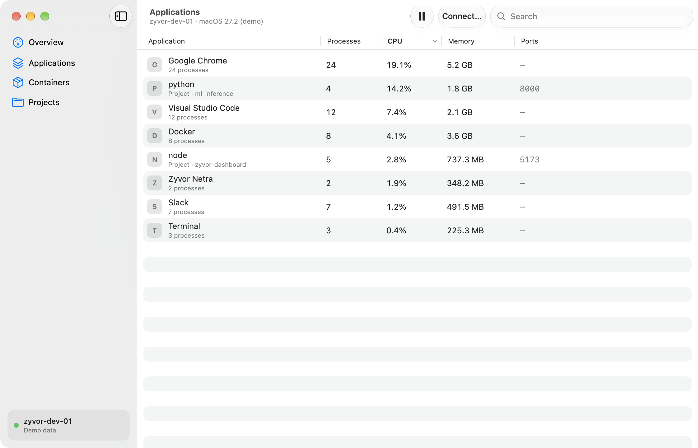 |

| Containers, dark | Overview, dark |
| --- | --- |
| 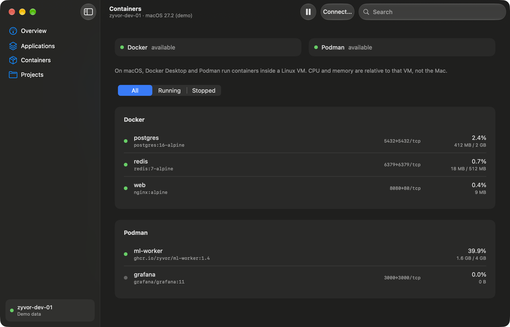 | 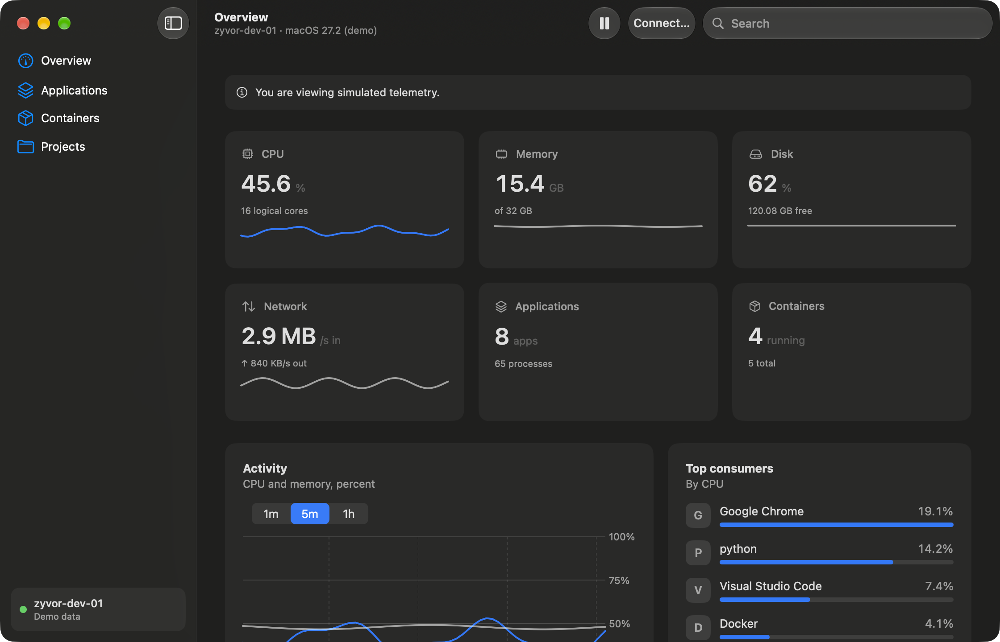 |

## Quickstart

**1. The dashboard, on simulated data** (Node ≥ 22.13; `npx pnpm@11.25.0 …` works without installing pnpm):

```bash
git clone https://github.com/zyvorai/zyvor-vytrix.git && cd zyvor-vytrix
npx pnpm@11.25.0 install --frozen-lockfile
npx pnpm@11.25.0 dev            # http://localhost:5173
```

**2. Your own readings, offline** (Python 3.10+, Linux or macOS, no root):

```bash
python3 agent/vytrix.py --once > snapshot.json
```

In the dashboard choose **Connect → Import collector snapshot** (or **Settings → Import**). Nothing leaves your machine.

**3. Live telemetry**

```bash
export VYTRIX_TOKEN="$(python3 -c 'import secrets; print(secrets.token_urlsafe(32))')"   # keep it out of source control
python3 agent/vytrix.py --allow-origin http://localhost:5173
```

Enter `http://127.0.0.1:9847/v1/snapshot` and the token in **Connect**. The dashboard polls every two seconds. The token stays in tab memory: it is not stored in `localStorage` and not sent anywhere else. For another machine, serve HTTPS with `--tls-cert`/`--tls-key` (or a TLS reverse proxy that passes `Authorization`). The UI refuses plain-HTTP collector URLs except on loopback.

### Collector flags

| Flag | Default | Purpose |
| --- | --- | --- |
| `--once` | | Print one snapshot, then exit |
| `--bind`, `--port` | `127.0.0.1`, `9847` | Where to listen. Plain HTTP on a non-loopback address prints a warning |
| `--allow-origin` | none | Exact browser origin allowed by CORS. Repeatable |
| `--tls-cert`, `--tls-key` | | PEM files: serve HTTPS (needed for remote browser access) |
| `--ui-upstream` | | Proxy non-API paths to a dashboard URL (same-origin deploys) |
| `--interval` | `2` | Seconds between samples |
| `--database` | `~/.local/share/vytrix/history.sqlite` | History (30-day retention, directory 0700, file 0600) |
| `--no-containers` | | Skip Docker and Podman |
| `--container-interval` | `5` | Seconds between container polls |

Endpoints: `GET /v1/snapshot`, `GET /v1/history?since=…&limit=…` (both need the bearer token and an allowed origin), and unauthenticated `GET /healthz`. Everything is a read; mutations are not supported. See [docs/API.md](docs/API.md).

## Views

| Section | Views |
| --- | --- |
| Monitor | Overview, CPU, Memory, Disk, Network, Battery |
| Workloads | Applications (grouped), Containers (Docker and Podman), Projects (developer servers by folder) |
| System | Alerts (threshold checks), Settings (window style, appearance, accent, reduced transparency, thresholds, import/export) |

Also: search, CPU or memory sort, pause and resume, 1m/5m/1h activity history (captured while the tab is open, at most 1,800 samples), and JSON import/export.

## Install as a service

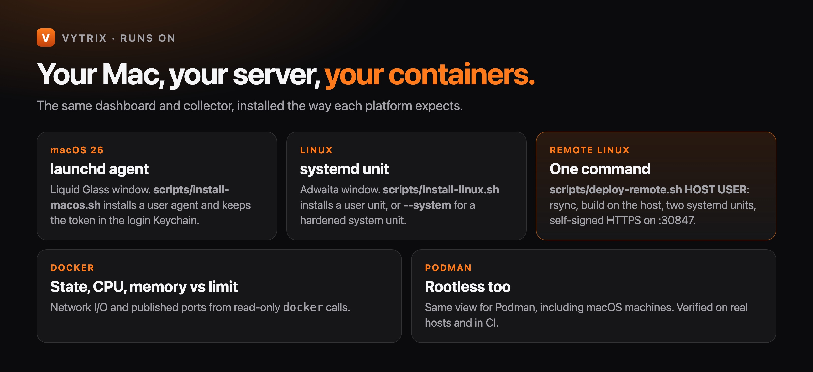

```bash
scripts/install-macos.sh --allow-origin http://localhost:5173     # launchd agent, token in the login Keychain
scripts/install-linux.sh --allow-origin http://localhost:5173     # systemd user unit (--system for a hardened system unit)
```

Both accept `--dry-run`, `--port` and `--no-containers`.

## Deploy to a Linux server

```bash
./scripts/deploy-remote.sh 203.0.113.10 deploy      # HOST USER, or user@host
./scripts/deploy-remote.sh HOST USER --quick        # sync + restart, no build
./scripts/deploy-remote.sh HOST USER --verify-only
./scripts/deploy-remote.sh HOST USER --dry-run      # prints the plan; no SSH
```

It syncs the checkout over SSH (one multiplexed connection) to `~/.vytrix/app`, builds it there (with a private Node 22 if the system Node is older), and installs two systemd units: the dashboard on `127.0.0.1:8787` and the collector on **`https://HOST:30847`** with a self-signed certificate that covers the host, proxying the dashboard on the same origin. The token is created once in `~/.vytrix/env` (0600). Open the URL, accept the certificate, **Connect** (the endpoint is pre-filled) and paste the token. Needs SSH, passwordless `sudo`, Python 3.10+, `curl`, `openssl`, `rsync`. Details: [docs/RELEASE.md](docs/RELEASE.md).

## Read-only by design

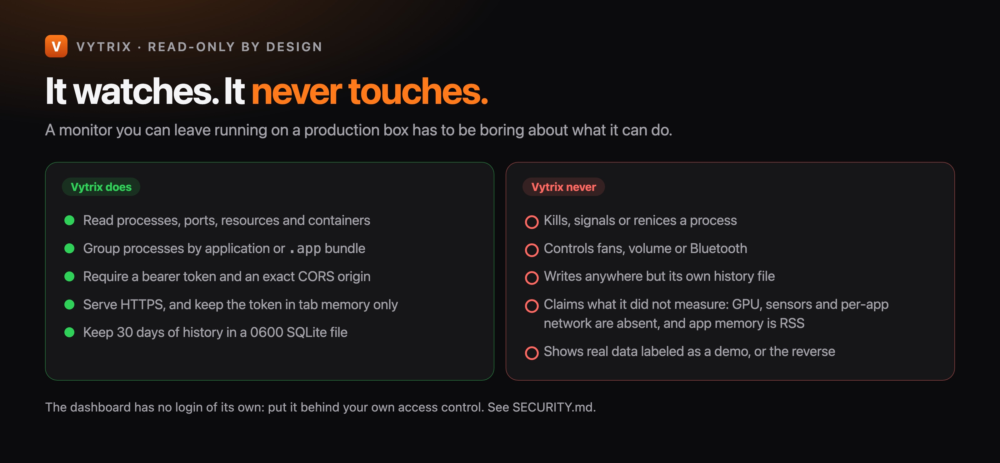

The dashboard has no login of its own: put it behind your own access control. What the collector token protects, and what it does not, is in [SECURITY.md](SECURITY.md).

## Verification

```bash
pnpm typecheck && pnpm lint
pnpm test          # telemetry schema tests + Python collector tests
pnpm build
pnpm test:e2e      # Playwright: WebKit, Chromium, mobile WebKit
pnpm shots         # regenerate docs/ux screenshots (simulated telemetry)
```

What was run where, and what was not, is listed honestly in [docs/RELEASE.md](docs/RELEASE.md) and [docs/TESTING.md](docs/TESTING.md).

## Documentation map

| I want to… | Read |
| --- | --- |
| Call the collector, or learn what each metric means | [docs/API.md](docs/API.md) |
| Monitor several Macs (read-only) | [docs/CLUSTER.md](docs/CLUSTER.md) |
| Test on macOS and Linux | [docs/TESTING.md](docs/TESTING.md) |
| Release or deploy | [docs/RELEASE.md](docs/RELEASE.md) |
| Understand the design rules | [docs/design/UX-CONTRACT.md](docs/design/UX-CONTRACT.md) |
| Report a vulnerability | [SECURITY.md](SECURITY.md) |
| Contribute | [CONTRIBUTING.md](CONTRIBUTING.md), [AGENTS.md](AGENTS.md) |
| Regenerate screenshots, the demo GIF, social images and the Pages site | [docs/README.md](docs/README.md) |
| See what changed | [CHANGELOG.md](CHANGELOG.md) |

## Scope

An initial read-only release. It does not kill processes, control fans or volume, inspect Bluetooth devices, measure per-app network or disk I/O, or collect GPU metrics. App memory is RSS, not unique physical memory. On macOS, Docker Desktop and Podman run containers inside a Linux VM, so container CPU and memory are relative to that VM. The collector retains up to 30 days in SQLite; the dashboard's own history is the samples captured while the tab is open.

## Maturity

| Area | Status |
| --- | --- |
| Collector (Linux, macOS), API, history, TLS, proxy | Working; native runs on macOS 26 and Ubuntu 24.04, tested in CI |
| Docker and Podman | Working; parsing tested from recorded output, plus real Docker and Podman checks in CI |
| Dashboard | Working; Playwright on WebKit, Chromium and mobile WebKit |
| Installers (launchd, systemd) and remote deploy | Working; dry-run checked in CI |
| Mac cluster (worker + coordinator, read-only) | Experimental; tested with unit and mocked e2e tests and one real Mac enrolled over loopback. Not yet checked across two Macs or over HTTPS |
| Native Mac app | Built and run on macOS 27.2 (Apple silicon) with live and demo data; no automated tests, not notarized |
| Homebrew formula | Stub, not published |
| GPU, sensors, per-app network | Not collected |

## License

[Apache-2.0](LICENSE). Copyright 2026 Zyvor AI Labs Private Limited. See [NOTICE](NOTICE) and [THIRD_PARTY.md](THIRD_PARTY.md).

<div align="center">

**See what your machine is really doing.** · [Quickstart](#quickstart) · [Security](SECURITY.md) · [Changelog](CHANGELOG.md)

</div>
